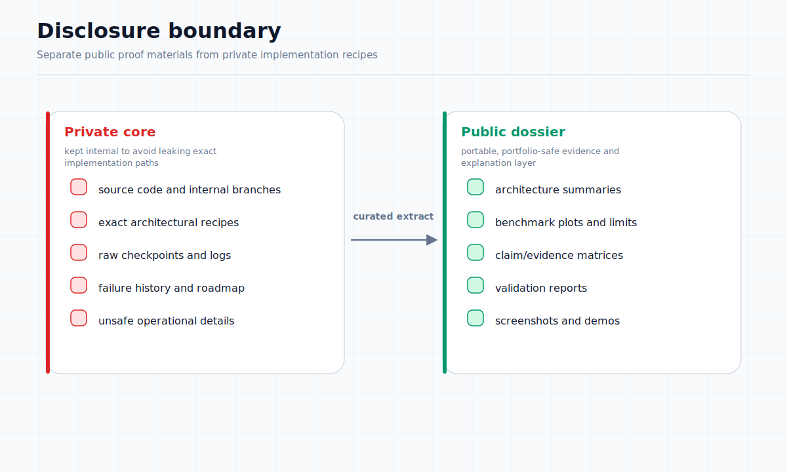

# Sonata Public Technical Dossier — Front Matter

**Document:** 00 of 10  
**Status:** Public Dossier (L4)  
**Last updated:** 2026-06-18

---

## What Sonata is

Sonata is a private, closed-source, low-level AI research platform. It contains a custom tensor/autograd/runtime stack, heterogeneous CPU/GPU execution, checkpointing and training infrastructure, quantization experiments, Mamba-style sequence modeling, and an early symbolic-control layer (Logos). The platform is implemented primarily in Free Pascal with x86-64 Assembly acceleration and a CUDA C++ GPU backend.

Sonata is best understood as a laboratory research platform — a working system with validated subsystems, clear hardware limits, and a narrow-domain roadmap. It is not a finished product, a universal AI system, or a commercially deployed service.

## What Sonata is not

- Not a product or a commercially ready service
- Not an open-source project — the code remains private
- Not a general-purpose conversational AI system
- Not a mature symbolic reasoning platform
- Not a production-ready security or defense system
- Not guaranteed to scale beyond its current laboratory constraints

## Why the code remains closed

Sonata is a private research project. The implementation details, exact architectural recipes, and experimental history are not part of the public disclosure. This dossier exists to show what has been built and tested without exposing the source code or enabling direct reproduction of the private system.

## What evidence is public

This dossier contains:

- High-level architecture descriptions
- Selected benchmark results and validation metrics
- Verified capability summaries from repository inspection and test execution
- Limitation notes and failure analyses
- Diagrams illustrating system structure and behavior

No raw source code, implementation recipes, or private experimental data are included.

## How to read this dossier

The dossier is structured as a technical journal issue. Each document is self-contained but cross-references others where relevant. The recommended reading order is:

1. Front Matter (this document)
2. Architecture Overview
3. Autograd + Mamba Integration
4. Training Laboratory Results
5. Benchmark Correction and Stability-First Engineering
6. GPU and Heterogeneous Execution Evidence
7. Quantization Evidence
8. Logos / Symbolic-Control Bridge
9. LTP / Transport Foundations
10. Limitations and Open Problems
11. Evidence Index

## Hardware and resource context

All results in this dossier were produced on a single development environment:

- CPU: Intel Core i7-10750H (laptop-class)
- GPU: NVIDIA GeForce RTX 2070 Super (mobile, 8 GB VRAM)
- RAM: 32 GB
- OS: Windows

This context is central to interpreting the results. The platform is designed around compact runtime principles, but training and optimization still obey hardware limits. Current results were achieved under laptop-class constraints, which makes them encouraging but also limits scale, duration, and variety of experiments.

## Limitation statement

> This dossier is not a product launch and not a funding promise. It is a technical record of selected results from a private research platform.

The following limitations apply to all claims in this dossier:

- All results are laboratory results, not production benchmarks
- Training scale is constrained by available hardware
- Several subsystems are validated in narrow tests but not hardened for general use
- Security, trust, and governance layers are incomplete
- Performance measurements reflect specific configurations and may not generalize
- No guarantee of timeline or readiness for public deployment
