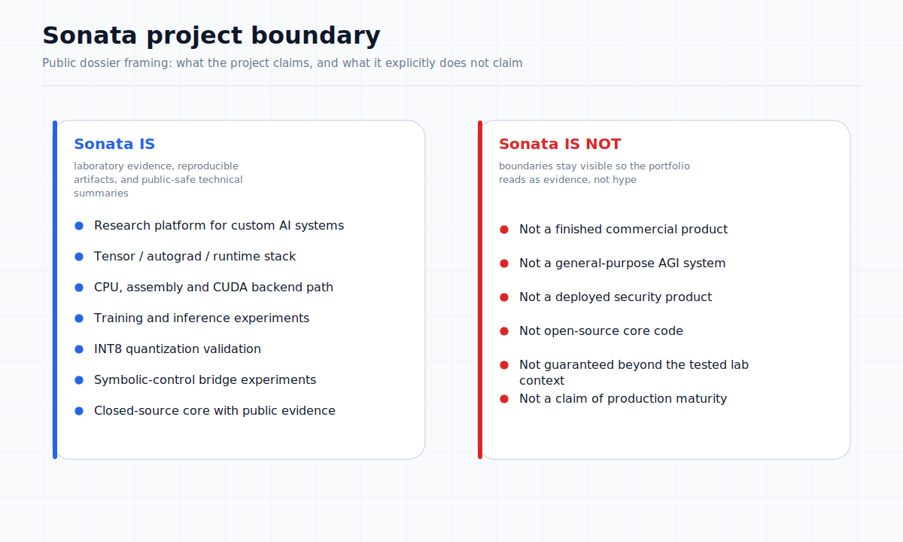
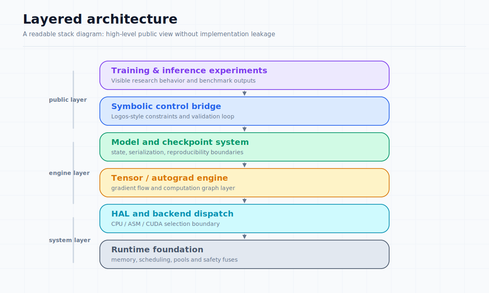

# Architecture Overview

**Document:** 01 of 10  
**Status:** Public Summary (L2)  
**Source reference:** Sonata Design Book v1, Capability Map 2026-06-02

---

## Project boundary

Sonata is a low-level AI research stack. Unlike high-level frameworks that orchestrate existing libraries, Sonata implements its own execution substrate: custom memory management, tensor operations, autograd graph, hardware abstraction layer, and model serialization format. This allows full control over the compute path from assembly-level kernels to training loop logic.

The system is not a wrapper around existing frameworks. It is a self-contained runtime with its own compilation, dispatch, and execution pipeline.



## System layers



### Runtime layer

The runtime provides manual memory management (no garbage collector), deterministic execution paths, and a pluggable backend dispatch system. It is designed to run without external dependencies beyond the operating system and optional GPU drivers.

A warmup-based batch size autotuner profiles GPU throughput at multiple batch sizes before training begins, selecting the configuration that maximizes tokens per second on the current hardware. This is a runtime-level component and is the subject of active development.

### Tensor and autograd layer

Sonata implements a custom tensor library with lazy evaluation. Operations are recorded into a graph structure before execution, enabling operation fusion and memory optimization. The autograd engine supports automatic differentiation through recorded operation graphs and integrates with the GPU backend for accelerator-backed training.

### Model and checkpoint layer

Models are defined as compositions of layers (linear, embedding, normalization, sequence modules). The checkpoint system serializes model state into a native binary format. Checkpoint round-trip, training resume with matching loss, and GPU-only checkpoint paths have been validated.

### GPU and CPU backend layer

The system contains a hardware abstraction layer that dispatches operations across multiple backends:

- **GPU (CUDA):** cuBLAS-backed matrix operations, custom CUDA kernels for elementwise ops, convolutions, normalization, and sequence scans. Dynamic library loading with graceful fallback.
- **CPU multithreaded:** Parallelized execution across available cores.
- **Assembly (x86-64):** SIMD-optimized kernels for specialized operations.
- **Pascal reference:** Unoptimized reference implementation for correctness validation.

Backend selection is dynamic: if a GPU operation is unsupported or the driver is unavailable, execution falls back through the dispatch chain automatically.

### Training and inference experiments

The training path supports gradient-based optimization through the custom autograd engine, GPU-resident execution discipline, mixed-precision paths, and checkpoint/resume. Training runs have been conducted under laptop-class hardware constraints and documented with throughput, memory, and stability measurements.

### Symbolic-control layer (Logos)

Logos is an early symbolic-control bridge that participates in training and evolution experiments through contradiction detection, axiom-guided penalties, and guarded evolution. It is implemented as a separate symbolic environment that interfaces with the neural stack. Current capabilities are preliminary: the bridge is operational in narrow test scenarios but not hardened into a mature symbolic platform.

### Transport foundations (LTP)

The Low-Throughput Protocol provides message serialization, chunk transfer, and integrity verification (CRC) for distributed node communication. It is currently transport and integrity infrastructure, not a secure distributed operations platform.

## Closed code / public evidence split

```
Private (source code, recipes, experiments):
  ├── Full implementation of all layers
  ├── Exact architectural configurations
  ├── Experimental history and failure details
  └── Future roadmap and research directions

Public (this dossier):
  ├── High-level architecture descriptions
  ├── Selected benchmark metrics and validation results
  ├── Verified capability summaries
  ├── Limitation and failure analyses
  └── Architecture and evidence diagrams
```

## What this proves and what it does not prove

**Proven:** Sonata has a working low-level research stack with multiple validated subsystems. The architecture supports heterogeneous execution, training experiments, checkpointing, quantization, sequence modeling, and symbolic-control integration.

**Not proven:** Production reliability, broad generalization, security readiness, or near-term deployment capability. The architecture is best evaluated as a research platform, not a finished system.
