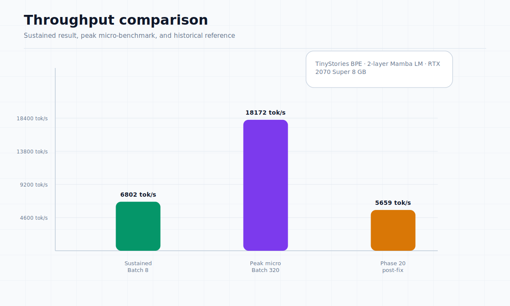
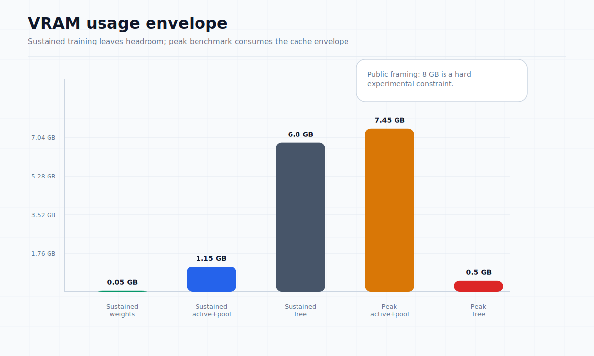

# Training Runs Under Laptop-Class Constraints

**Document:** 03 of 10  
**Status:** Public Evidence (L3)  
**Source reference:** benchmark_phase20.md, Capability Map 2026-06-02, TinyStories BPE live run 2026-06-18

---

## Hardware context

All training results were produced on a laptop-class environment:

| Component | Specification |
|-----------|---------------|
| CPU | Intel Core i7-10750H |
| GPU | NVIDIA GeForce RTX 2070 Super (mobile, 8 GB VRAM) |
| RAM | 32 GB |
| Storage | Local SSD |

This hardware context is central to interpreting the results. Training is constrained by:

- **VRAM ceiling:** 8 GB hard limit prevents large batch sizes and long sequences
- **Thermals:** Laptop cooling limits sustained GPU compute
- **Time:** Development and training time are constrained by available resources
- **Iteration speed:** Slower than dedicated workstation or cluster environments

## What the training path currently demonstrates

**Verified capabilities:**

- Training loop executes end-to-end through the custom autograd engine
- Gradients flow through all connected modules (embedding, Mamba, output projection)
- GPU-resident execution with minimized host-to-device (H2D) transfer
- Checkpoint and resume with matching loss
- Zero CPU fallback in specific benchmark configurations
- Automatic Mixed Precision (FP16/AMP) path operational

**Current training benchmark (TinyStories BPE, GPU):**

| Metric | Sustained (30 steps) | Peak (micro-benchmark) |
|--------|---------------------|------------------------|
| Throughput | ~6,800 tok/s overall (7,000–8,500 steady state) | ~18,000 tok/s |
| Batch size | 8 (effective 16, grad accum 2) | 320 |
| VRAM usage | 1.2 GB | 7.5 GB |
| CPU fallbacks | 0 | 0 |
| Host offload | 0 B | 0 B |

Model: 2-layer Mamba LM, 182K parameters, EmbedDim=96, StateDim=16, SeqLen=128.

Dataset: TinyStories BPE (o200k_base vocabulary, active vocab 73 tokens).

The sustained figure reflects real training with the autotuner active. The autotuner profiles the GPU at multiple batch sizes before training begins and selects the configuration that maximizes throughput within profile constraints. In the sustained run, the autotuner profiled batch sizes 1–32, selected batch 12 as optimal (20,480 tok/s during profiling), but the final batch was capped at 8 by the profile's MaxMicroBatch limit, with gradient accumulation of 2 giving an effective batch size of 16.

The peak micro-benchmark was obtained by overriding profile batch limits via FixedBatchOverride and disabling the autotuner, achieving batch 320 for 4 warm-start steps. This represents the maximum achievable throughput in a favourable micro-benchmark, not representative of normal training conditions.

**Historical reference (Phase 20, synthetic benchmark):**

| Metric | post-fix (stable) |
|--------|-------------------|
| Throughput | ~5,659 tok/s |
| H2D traffic | ~16 KB/step |
| VRAM usage | ~4.2 GB |

Model: Embedding(50257,768) + Mamba(768,16) + Linear(768,50257), 2.2M parameters, Batch=4, Seq=256.

## Throughput context

The current TinyStories sustained throughput (~7,000-8,500 tok/s) reflects real training with profile-default batch size (Batch=8, effective 16 with gradient accumulation). The lower batch size keeps VRAM usage at 1.2 GB, well within the 8 GB ceiling. A peak micro-benchmark with Batch=320 achieved ~18,000 tok/s but is not representative of normal training — it bypasses profile limits and operates the model at maximum VRAM capacity.

The older Phase 20 benchmark used a full-vocabulary model (50,257 tokens) with a large output projection that dominated the compute budget. Results across different model configurations are not directly comparable; neither should be read as a universal throughput claim.

## CPU fallback discipline

The training path maintains a strict GPU-resident standard in validated configurations, validated across FP32, mixed precision, and INT8 modes. In all documented benchmark runs, CPU fallback count during training steps was zero.

## Failure modes and fixes

**Observed failure: training divergence in stacked sequence layers**

Training with directly-parameterized state transitions could diverge within 100 steps under higher learning rates. The fix applied a post-step constraint on the state transition parameter to maintain contracting dynamics. See document 02 for details.

**Observed failure: memory leaks producing inflated performance**

Earlier Phase 20 benchmark runs showed higher throughput (~7,676 tok/s) that was later identified as an artifact of memory leaks and VRAM overflow. After fixing memory discipline, stable throughput settled at ~5,700 tok/s for that configuration. See document 04 for the full analysis.

## Why this does not imply broad model quality

The current results are encouraging because they demonstrate a working training path under constrained hardware. However, they remain laboratory results:

- Training has not been scaled to demonstrate downstream task quality
- Generalization across diverse datasets has not been measured
- Production reliability under continuous operation has not been established
- Performance on standard benchmarks (perplexity, downstream eval) is not yet published
