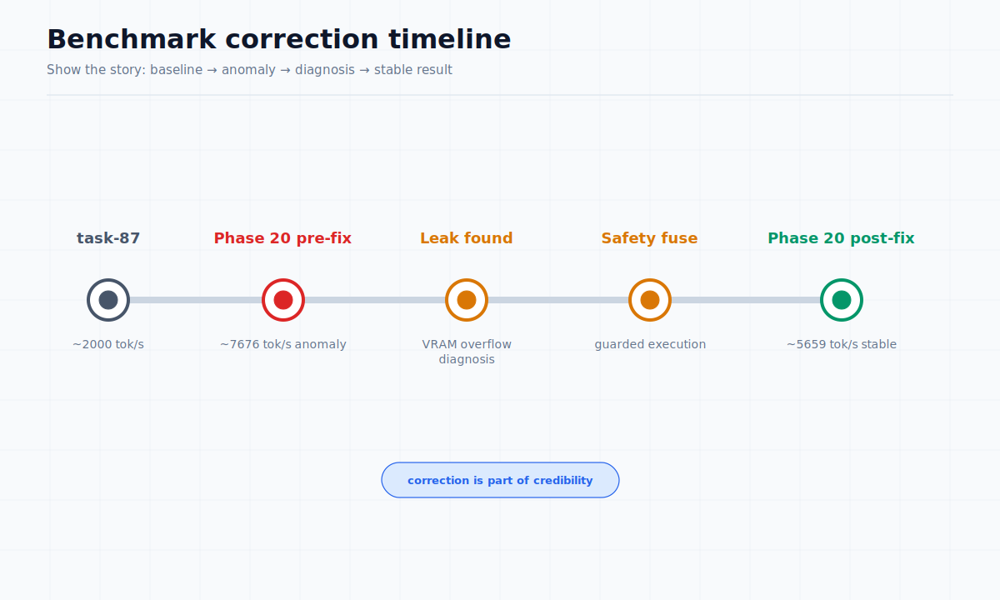
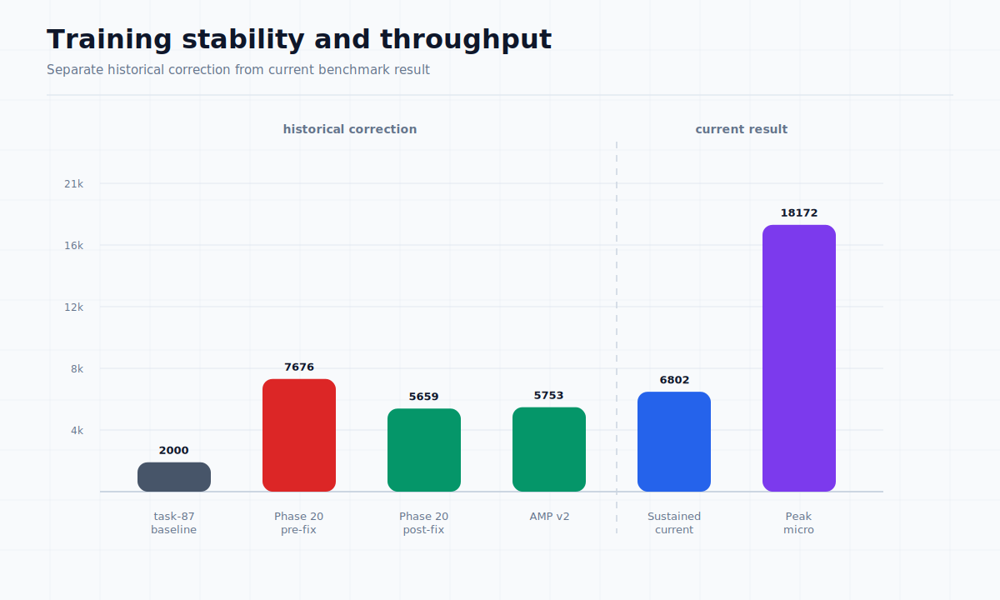

# Benchmark Correction and Stability-First Engineering

**Document:** 04 of 10  
**Status:** Public Dossier (L4)  
**Source reference:** benchmark_phase20.md, TinyStories BPE live run 2026-06-18

---

## Initial faster result

During Phase 20 benchmarking, the project initially reported a throughput of approximately **7,676 tok/s** on an RTX 2070 Super (Batch=7, Seq=256). This result was faster than the previous baseline (~2,000 tok/s) by a factor of approximately 3.8x and appeared to demonstrate significant optimization progress.

## Memory leaks and VRAM overflow interpretation

Closer analysis revealed that the higher throughput was an artifact of unsafe memory behavior:

- **Memory leaks:** Intermediate activations that should have been freed after the backward pass remained in VRAM, creating the appearance of full GPU utilization while actually occupying memory with unreleased allocations.
- **VRAM overflow:** Actual memory consumption exceeded the 8 GB physical VRAM limit. The CUDA driver began using system RAM as swap, which added latency but paradoxically maintained throughput through parallelism while hiding instability.
- **No safety fuse:** The memory allocator had no emergency check, allowing unbounded allocation that led to fragmentation, corrupted state, and non-deterministic results.
- **Unstable computation:** Memory corruption could produce NaN/Inf values under continued operation, and results were not reproducible.

## Post-fix stable result

After implementing memory discipline fixes (correct activation freeing, VRAM emergency allocator guard, deterministic allocation patterns), the same benchmark configuration produced:

| Metric | Pre-fix | Post-fix |
|--------|---------|----------|
| Throughput | ~7,676 tok/s | ~5,659 tok/s |
| VRAM usage | ~6.9 GB (overflow masked) | ~4.2 GB (clean) |
| Stability | Unstable (NaN, crashes) | Stable |
| Reproducibility | Non-reproducible | Reproducible |
| Memory safety | Leaks, overflow | Clean |

## Why lower stable throughput is more valuable

The regression of approximately 26% in raw throughput is not a bug — it is a fix. The post-fix numbers reflect actual system performance under safe, reproducible conditions:

- Lower throughput that is **deterministic and reproducible** is more scientifically useful than higher throughput that cannot be relied upon.
- Memory-safe execution prevents silent corruption that would invalidate any training results.
- The safety fuse (emergency allocator guard) prevents the system from exceeding physical VRAM and swapping to host memory, which would catastrophically slow training under larger configurations.

## Lessons for future benchmarks

1. **Always measure memory safety alongside throughput.** A fast result that leaks memory or overflows VRAM is not a valid benchmark.
2. **Stability before optimization.** The project's decision to fix memory discipline before chasing higher numbers is an engineering priority that should continue.
3. **Document the failure.** The existence of this correction note is itself evidence of engineering discipline.
4. **Ceiling awareness within model context.** The Phase 20 model configuration showed a stable ceiling of ~6,000 tok/s on this hardware. A different, smaller model (TinyStories BPE, 182K params) achieves ~7,000-8,500 tok/s sustained with profile-default batch sizing, and up to ~18,000 tok/s in a peak micro-benchmark. The meaningful ceiling is hardware- and model-dependent.

## Why this matters

This document may be one of the strongest trust-building artifacts in the public dossier. It shows correction, not self-promotion — the project identified an inflated benchmark, diagnosed its cause, fixed the underlying issue, and accepted a lower number because it is the correct one.

## Current relevance

The Phase 20 correction story is a historical record of the project's engineering discipline. Subsequent TinyStories BPE sustained training (document 03) achieves ~6,800 tok/s overall with profile-default settings, and up to ~18,000 tok/s in a peak micro-benchmark. The correction itself remains valid: the pre-fix Phase 20 result was an artifact of memory leaks, and the post-fix Phase 20 result is the accurate baseline for that configuration.
