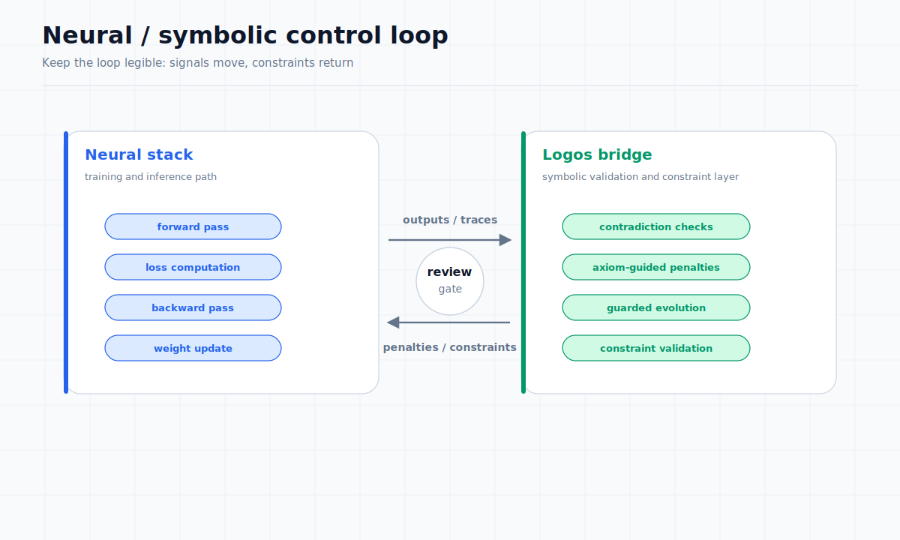

# Logos / Symbolic-Control Bridge

**Document:** 07 of 10  
**Status:** Public Summary (L2/L3)  
**Source reference:** Capability Map 2026-06-02

---

## What Logos is in the public narrative

Logos is an early symbolic-control bridge integrated with Sonata's neural stack. It operates as a separate symbolic environment that can participate in training and evolution experiments through:

- Contradiction detection during neural inference
- Axiom-guided penalties applied to training loss
- Guarded evolution with symbolic constraint validation

It is not a mature reasoning platform. It is an experimental bridge between learned representations and symbolic constraints, implemented at a prototype level.

## Contradiction traces

In reflection-mode tests, Logos successfully detected contradictions in generated outputs. When the neural module produced results that violated symbolic constraints, Logos flagged the contradiction and provided trace information.

## Axiom-guided penalties

Logos can contribute to training by computing penalty terms based on symbolic rule violations. In validated test scenarios, these penalties influenced the loss function and guided optimization away from outputs that violated defined axioms.

## Guarded evolution

Structural evolution experiments completed successfully with Logos-based guard enabled. The guard function validated candidate mutations against symbolic constraints before accepting them into the evolving population. This demonstrates a working loop between the neural evolution system and a symbolic validation layer.

## Current fragility

- Full Logos daemon setup is not packaged as a turnkey test — the test suite reports it as skipped in standard automated runs
- One APL symbolic derivative optimization sub-check soft-skipped or failed while the overall suite continued
- Integration is operational in narrow scenarios but not hardened for arbitrary use
- Documentation and packaging of the symbolic environment are incomplete

## Missing hardening and packaging

- No stable API contract between the neural stack and Logos
- No comprehensive test suite for symbolic constraint definitions
- No fallback behavior specification when Logos is unavailable
- Limited documentation for defining new axiom sets
