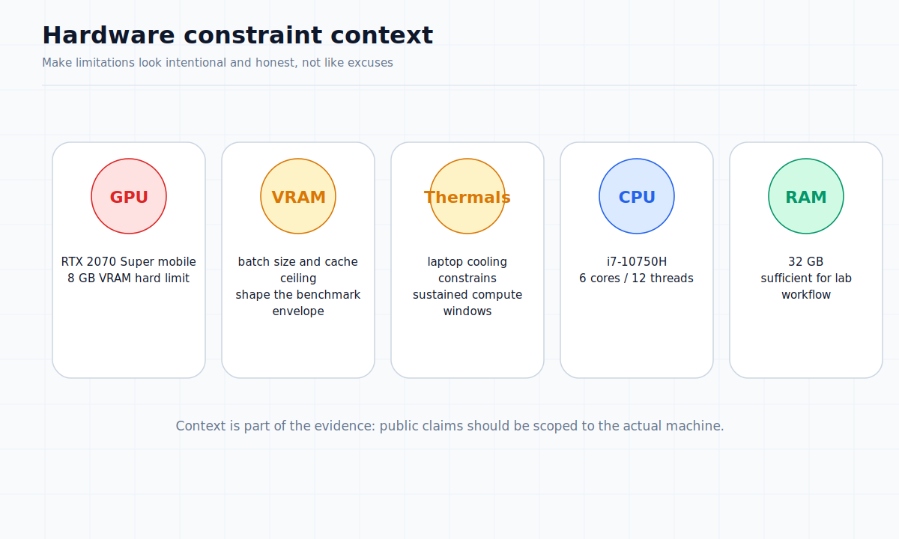

# Limitations and Open Problems

**Document:** 09 of 10  
**Status:** Public Dossier (L4)

---

This document exists to make limitations a first-class part of the public dossier. Every achievement documented elsewhere in this dossier should be read alongside the limitations listed here.

## Laptop-class hardware

- All development and validation occurs on a single laptop-class machine
- Results may not generalize to different hardware configurations
- No access to workstation, cluster, or cloud GPU environments for cross-validation

## Mobile GPU limits

- GPU is an NVIDIA RTX 2070 Super (mobile variant)
- Reduced thermal headroom compared to desktop equivalents
- Sustained compute is limited by laptop cooling capacity
- No multi-GPU testing has been performed

## VRAM ceiling

- Hard limit of 8 GB VRAM
- Prevents training with larger batch sizes or longer sequences
- INT8 quantization partially mitigates this but does not eliminate the constraint
- Gradient checkpointing and model parallelism are planned but not yet implemented

## Thermals

- Laptop thermals limit sustained GPU compute
- Benchmark results may degrade under prolonged training runs
- Thermal throttling behavior has not been systematically documented

## Time constraints

- The project is developed and tested under resource and time constraints
- Some subsystems are validated in narrow tests but not exercised through extended operation
- No continuous integration or automated long-duration test suite

## Incomplete training scale

- Training runs have not been scaled to demonstrate downstream task quality
- Generalization across diverse datasets has not been measured
- No published perplexity or standard downstream evaluation results
- Training has not been validated beyond early convergence stages

## Incomplete security and trust stack

- No authentication or authorization layer
- No encrypted transport for distributed communication
- No secure key management or artifact provenance
- No audit trail suitable for regulated operations
- CRC integrity is present but is not a substitute for cryptographic security

## Immature packaging for some subsystems

- Logos symbolic-control bridge: operational in narrow tests but not packaged as a turnkey system
- AMD GPU support: Vulkan backend exists experimentally but is not validated at the same level as CUDA
- Full daemon and service packaging is incomplete for several subsystems

## No claim of near-term public product readiness

- The project remains a research platform
- No release date, beta timeline, or public deployment schedule is promised
- Subsystems validated in the laboratory require additional hardening for production use
- The gap between laboratory validation and production reliability is acknowledged but not yet bridged

## Autotuner maturity

The batch size autotuner is operational and guided the sustained training benchmark, but it is not yet a hardened component:

- The search algorithm is simple (warmup-based two-phase) and may not find the global optimum for all model sizes
- Autotuner results can be overridden by profile caps (MaxMicroBatch) in ways that confuse the reported throughput expectations
- No persistent cache of autotuning results across training runs
- The interaction between autotuner-selected batch size and gradient accumulation steps is not independently optimized
- Stability and repeatability of autotuner decisions across hardware states (e.g., thermal) have not been characterised

Improving the autotuner is an active development priority and will directly affect the usability of the training path.

## What this dossier does and does not claim

| Claim status | Examples |
|-------------|----------|
| **Validated in narrow tests** | GPU execution, training path, INT8 quantization, checkpoint/resume, LTP transport |
| **Partially validated** | Logos symbolic bridge, Mamba-style stability constraint, AMP speedup |
| **Not claimed** | Production reliability, broad generalization, security readiness, deployment timeline |
